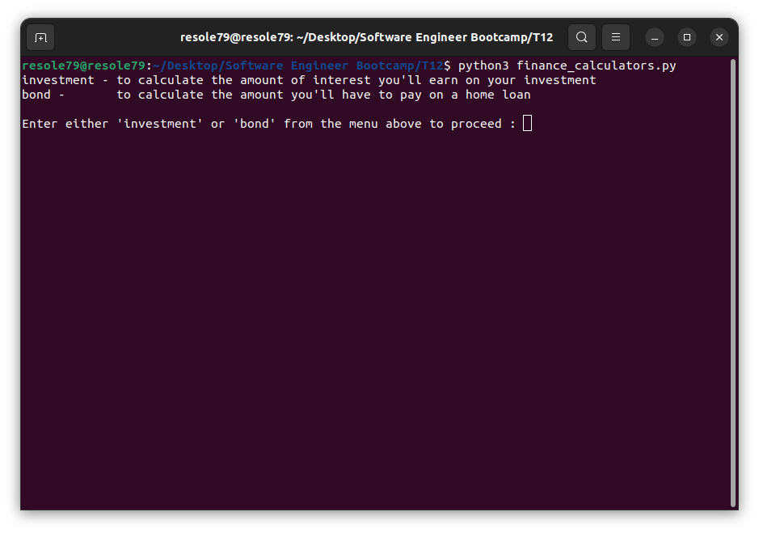
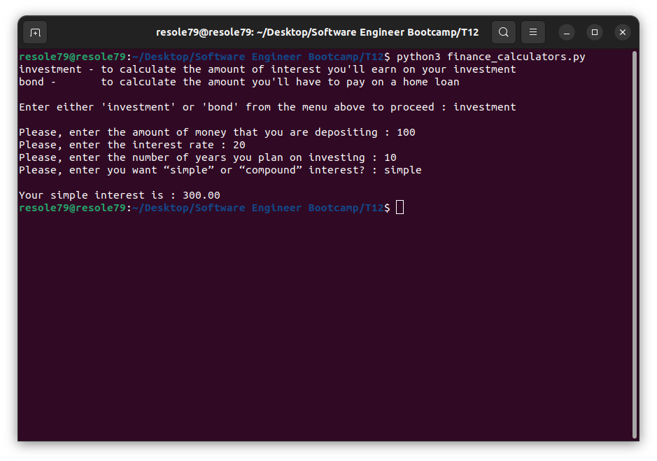
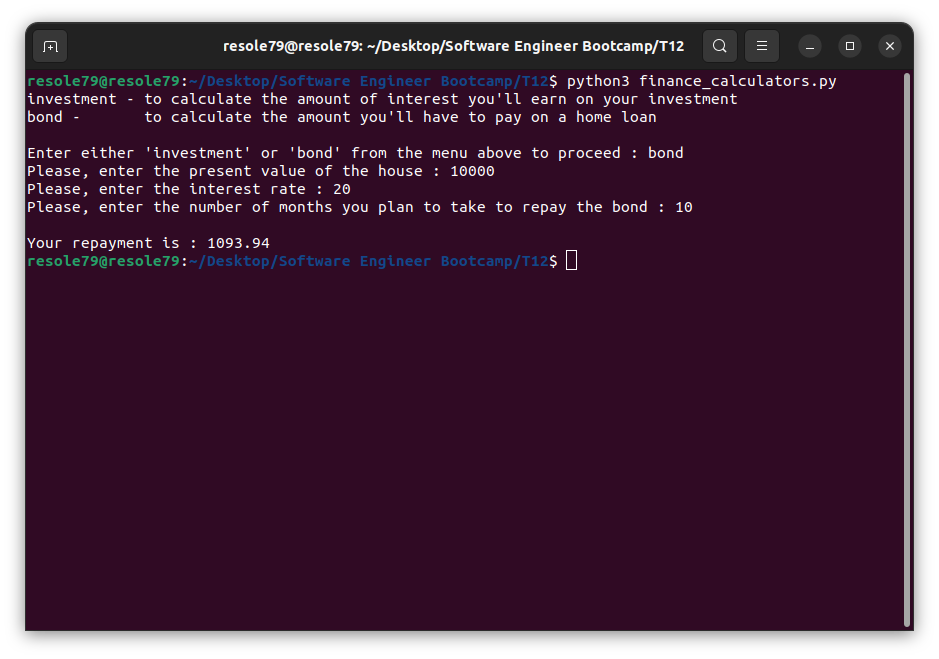

## Financial Calculator

Program that allows the user to access two
different financial calculators: an investment calculator and a home loan
repayment calculator for a small financial company


#### Installation
To get started with the financial calculators, follow these steps:

1. **Clone** the repository:

```sh
git clone https://github.com/resole79/finance_calculator.git
```

2. **Run** the **finance_calculator.py** file:

```sh
python finance_calculator.py
```

##

#### **Usage**

**How program present**

<p align="center"></p>


**User selects ‘investment’**

Ask the user to input:
 - The amount of money that they are depositing.
 - The interest rate (as a percentage). 
 - The number of years they plan on investing.
 - Then ask the user to input if they want “simple” or “compound” interest

<p align="center"><br><i>User selects “simple”</i></p>

<p align="center"><br><i>User selects “compound”</i></p>


#### **Interest formula:**
```
The total amount when **simple interest** is applied is calculated as follows: *𝐴 = 𝑃(1 + 𝑟 × 𝑡)*

The total amount when **compound interest** is applied is calculated asfollows: *𝐴 = 𝑃(1 + 𝑟)^𝑡*

In the formula above:
- ‘r’ is the interest entered above divided by 100, e.g. if 8% is entered, then r is 0.08.
- ‘P’ is the amount that the user deposits.
- ‘t’ is the number of years that the money is being invested.
- ‘A’ is the total amount once the interest has been applied.
```


**User selects ‘bond’**

Ask the user to input:
 - The present value of the house.
 - The interest rate.
 - The number of months they plan to take to repay the bond.


<p align="center"><br><i>User selects “bond”</i></p>


#### **Bond repayment formula:**
```
The amount that a person will have to be repaid on a home loan each
month is calculated as follows: *𝑟𝑒𝑝𝑎𝑦𝑚𝑒𝑛𝑡 = (i * P)/(1 - (1 + i)^(-n))*

In the formula above:
- ‘P’ is the present value of the house.
- ‘i’ is the monthly interest rate, calculated by dividing the annual interest rate by 12.
- ‘n’ is the number of months over which the bond will be repaid.
```

## **Credit**

Author : Emilio Reforgiato (resole79)

##
<p align="right"><a href="https://www.linkedin.com/in/emilio-reforgiato/" target=”_blank” ></a></p>

